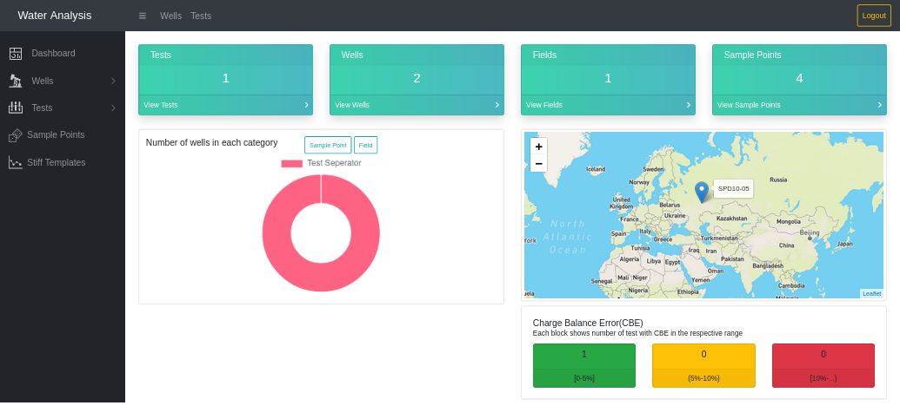

# water-analysis-system

A web application for oilfield water analysis management, comparison and track of changes in routine water sampling and analyis.

## Run

_docker-compose up --build_

In order to log in you need to create a super user as following:

1. Locate the container:
   _docker ps_
2. Log into the container:
   _docker exec -it container_name bash_
3. Run the following command and follow instructions that will appear on your screen:
   _python manage.py createsuperuser_
